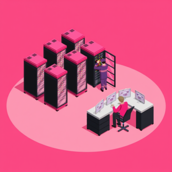
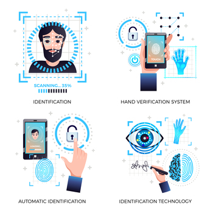

# Protección Física y Ambiental de los Equipos

La seguridad física se enfoca en proteger el hardware, las instalaciones y el personal de accesos no autorizados, daños o desastres naturales.

Por tanto, la seguridad física consiste en aplicar barreras físicas y procedimientos de control, como medidas de prevención y contramedidas ante amenazas a los recursos e información confidencial.

Se refiere a controles y mecanismos de seguridad, dentro y alrededor de la ubicación física de los sistemas informáticos, para protegerlos de amenazas físicas como robos, incendios, inundaciones y otros desastres.

## Centros de Procesado de Datos (CPD)

Un Centro de Procesado de Datos (CPD), o simplemente Centro de Datos o *Data Center*, es una instalación que alberga sistemas informáticos y componentes asociados, como sistemas de telecomunicaciones y almacenamiento de datos.

Es un edificio o una sala de un edificio usada para mantener en él una gran cantidad de equipamiento informático y electrónico. Suelen ser creados y mantenidos con el objetivo de tener acceso a la información necesaria para operar.

La gran mayoría de empresas medianas o grandes tienen algún tipo de CPD, mientras que las más grandes llegan a tener varios interconectados e incluso **Centros de Respaldo**. 

Un **centro de respaldo** es un CPD específico para tomar el control de otro en caso de cualquier contingencia o fallo que pueda ocurrir. 

El equipamiento hardware no tiene porque ser el mismo en el centro de respaldo con respecto al original, pero el software y los datos si, por lo que es necesario contar con una réplica de los mismos datos con los que se trabaja en el CPD original.

Los CPD se crean con el objetivo de **garantizar la continuidad y la alta disponibilidad** del servicio a clientes, empleados, proveedores, empresas colaboradores, etc.

Los requisitos generales que debe cumplir un CPD son los siguientes:

- Disponibilidad y monitorización constante de los sistemas.
- Fiabilidad ininterrumpida de los servicios.
- Seguridad, redundancia y diversificación:  se deben implementar medidas de seguridad física y lógica, así como redundancia en los sistemas y diversificación de proveedores y recursos.
- Control ambiental, prevención de incendios.

Es habitual que los CPD contengan grandes servidores que se pueden concentrar en una sala denominada *sala fría*, *nevera* o *pecera*. Esta sala requiere de un sistema específico de refrigeración para mantener una temperatura adecuada y evitar el sobrecalentamiento de los equipos.

## Ubicación y Condiciones físicas

Las condiciones atmosféricas adversas severas son difíciles de predecir y se localizan espacial y temporalmente en partes concretas del mundo.

La frecuencia y severidad de que ocurra un problema ambiental debe tenerse en cuenta al decidir la ubicación y construcción de un edificio o sala. Es necesario comprobar informes climatológicos o la existencia de un servicio que notifique la proximidad de condiciones adversas.

Algunos de los aspectos más relevantes a tener en cuenta son los **incendios**, **inundaciones**, **terremotos** y **tormentas**. Estos fenómenos pueden causar daños significativos a la infraestructura y a los equipos, por lo que es fundamental implementar medidas de prevención y respuesta adecuadas. Los **sistemas de detección y extinción de incendios**, así como las **barreras contra inundaciones**, son ejemplos de medidas que pueden ayudar a mitigar estos riesgos. 

Los **rayos** y las **interferencias electromagnéticas** también pueden afectar a los equipos electrónicos, por lo que es importante contar con sistemas de protección adecuados, como **pararrayos** y **blindaje electromagnético**. 

Un buen **sistema de aire acondicionado** es importante para el control de la temperatura y la humedad en el CPD, ya que las altas temperaturas pueden dañar los equipos y afectar su rendimiento.

También es necesario tener en cuenta los **cortes de energía**, **fallos en el suministro de agua** y **problemas de acceso físico**. Estos factores pueden afectar la operatividad de un CPD y deben ser considerados en los planes de contingencia.

:::info La importancia de la protección ambiental en el CPD
La protección ambiental es crucial para garantizar la seguridad física de un CPD. Esto incluye la implementación de medidas para prevenir y mitigar los efectos de desastres naturales, así como la protección contra amenazas externas como robos o vandalismo.
- **Climatización**: Sistemas de aire acondicionado y control de humedad para mantener un ambiente óptimo. Esto nos ayudará a evitar el sobrecalentamiento y la condensación.
- **Detección y Extinción de incendios**: Sistemas de detección temprana y extintores adecuados para minimizar el riesgo de incendios.
    - Detectores de humo y calor: Sensores que detectan la presencia de humo o un aumento de temperatura, activando alarmas y sistemas de extinción.
    - Sistemas de extinción automáticos: Sistemas que utilizan rociadores o agentes extintores para apagar incendios de forma automática.
        - Gas inerte: Sistemas que utilizan gases inertes, como el argón o el nitrógeno, para apagar incendios sin dañar los equipos electrónicos.
        - CO2: Sistemas que utilizan dióxido de carbono para apagar incendios, desplazando el oxígeno y sofocando las llamas.
        - FM-200: Sistemas que utilizan el agente extintor FM-200, que es seguro para los equipos electrónicos y tiene un tiempo de descarga rápido.
    - Extintores adecuados: Es importante contar con extintores de incendios en las instalaciones, ubicados en lugares estratégicos y de fácil acceso.
        - Tipo C: Extintores diseñados para fuegos que involucran equipos eléctricos, utilizando agentes no conductores.
- **Protección contra Polvo y Humedad**: Sistemas de filtración y deshumidificación para evitar la acumulación de polvo y la condensación de humedad en el CPD.
    - Mantener las salas limpias y ordenadas para facilitar la limpieza y reducir la acumulación de polvo.
    - Sistemas de filtrado de aire: Equipos que eliminan partículas y contaminantes del aire, mejorando la calidad del ambiente en el CPD.
:::

:::tip La ubicación de los CPD
La ubicación de los CPD debe ser cuidadosamente seleccionada para minimizar los riesgos asociados con desastres naturales y otros eventos adversos. Se recomienda ubicar los CPD en áreas geográficas con bajo riesgo de inundaciones, terremotos y otros fenómenos naturales. Además, es importante considerar la proximidad a fuentes de energía confiables y la disponibilidad de servicios de emergencia.

Dentro de un edificio, los CPD deben situarse en plantas elevadas para reducir el riesgo de inundaciones y en áreas con acceso controlado para protegerlos de intrusiones no autorizadas. Evitando zonas de paso y áreas comunes.
:::

## Control de Acceso Físico

Otra de las medidas de seguridad pasiva más relevantes es el **control de acceso físico**. Esto implica restringir el acceso a las instalaciones y equipos críticos solo a personal autorizado. Algunas de las medidas que se pueden implementar incluyen:

- **Cámaras de vigilancia**: Instalar cámaras en puntos estratégicos para monitorear el acceso y detectar actividades sospechosas.
- **Sistemas de identificación**: Utilizar tarjetas de acceso, biometría o códigos PIN para garantizar que solo el personal autorizado pueda ingresar a áreas sensibles.
- **Guardias de seguridad**: Contar con personal de seguridad en las instalaciones para supervisar el acceso y responder a incidentes.
- **Barreras físicas**: Implementar cercas, puertas de seguridad y otros obstáculos para dificultar el acceso no autorizado.

Estas medidas ayudan a proteger los activos físicos y la información sensible de la organización, reduciendo el riesgo de robos, vandalismo y otros incidentes de seguridad.

El uso de **credenciales de identificaciones** es uno de los puntos más importantes del sistema de seguridad físico. A fin de poder efectuar un control correcto de la entrada y la salida del personal a los diferentes sectores de la empresa.

El control del acceso físico no solo requiere de ser capaz de identificar al personal, sino también de **asociar la apertura o cerrado de puertas**. permitir o negar el acceso en base a restricciones de tiempo, área o sector dentro de una empresa o institución. 

A las personas se les puede identificar por *alguna posesión* como una llave, una tarjeta de acceso o un dispositivo físico, *por algo que sabe* como un PIN o una contraseña o por *algo que es o sabe hacer* como puede ser una firma o cualquier elemento biométrico, este último método es el más seguro, debido a ser el más complicado de falsificar.

:::info Tarjetas RFID
Las **tarjetas RFID** (Identificación por Radiofrecuencia) son dispositivos que utilizan tecnología de radiofrecuencia para identificar y rastrear objetos o personas. Estas tarjetas contienen un chip y una antena que les permite comunicarse con un lector RFID. Son ampliamente utilizadas en sistemas de control de acceso, ya que permiten una identificación rápida y sin contacto. 
:::

### Sistemas Biométricos

La **biometría** es una tecnología que utiliza características físicas o comportamentales únicas de una persona para su identificación. Algunos ejemplos comunes de sistemas biométricos incluyen:  

- **Reconocimiento facial**: Analiza las características faciales de una persona para verificar su identidad.
- **Lectores de huellas dactilares**: Capturan y comparan las huellas dactilares para autenticar a un usuario.
- **Reconocimiento de iris**: Utiliza patrones en el iris del ojo para identificar a una persona.
- **Voz**: Analiza las características de la voz para la autenticación.
- **VAF** o **Verificación Automática de Firmas**: Utiliza la firma manuscrita como método de identificación.

Existen otros métodos de autenticación biométrica, como el reconocimiento de venas de la mano o la dinámica de la escritura, que también se están explorando para mejorar la seguridad en el acceso físico.

### Circuito Cerrado de Televisión (CCTV)

La protección electrónica a la detección de robo, intrusión, asalto e incendios a través del uso de *sensores conectados a centrales de alarmado*. Estas centrales tienen conexión con los elementos de señalización que son los encargados de notificar al personal de una emergencia. 

Uno de los métodos mas empleados en empresass son los circuitos de cámaras de grabación de vídeo o **circuitos cerrados de televisión (CCTV)**. Estos sistemas permiten la vigilancia y grabación de eventos en tiempo real, lo que facilita la identificación de intrusos y la recopilación de pruebas en caso de incidentes.

Actualmente, los sistemas de CCTV han evolucionado para incluir características avanzadas como análisis de video, detección de movimiento y notificaciones en tiempo real, lo que mejora aún más su eficacia en la seguridad física.

Por un coste relativamente bajo, existen cámaras como las cámaras IP, que permiten la transmisión de video a través de redes informáticas, facilitando la vigilancia remota y el acceso a las grabaciones desde cualquier lugar.

Estos dispositivos son autónomos y cuentan con un servidor web de vídeo integrado, que les permite transmitir su imagen a través de redes IP como LAN, WAN o WLAN. Las cámaras permiten al usuario tener la cámara en una localización y ver el vídeo en tiempo real a través de la red.

## Sistemas de Alimentación ininterrumpida

Los **sistemas de alimentación ininterrumpida (SAI)** o también llamados **UPS** (Uninterruptible Power Supply) son dispositivos que proporcionan energía eléctrica de respaldo a equipos críticos en caso de un corte de energía. Estos sistemas son esenciales para garantizar la continuidad del servicio y proteger la información almacenada en servidores y otros dispositivos.

Los SAI funcionan mediante baterías que se activan automáticamente cuando se detecta una interrupción en la alimentación eléctrica. Además de proporcionar energía de respaldo, muchos SAI también ofrecen protección contra sobretensiones y picos de voltaje, lo que ayuda a prevenir daños en el hardware.

Es importante seleccionar un SAI adecuado en función de la carga eléctrica de los equipos que se desea proteger y el tiempo de autonomía requerido. Algunos factores a considerar al elegir un SAI incluyen:

- **Capacidad de carga**: La cantidad de energía que el SAI puede proporcionar a los dispositivos conectados.
- **Tiempo de autonomía**: La duración durante la cual el SAI puede suministrar energía en caso de un corte de energía.
- **Tipo de onda de salida**: La forma de la señal eléctrica que el SAI proporciona a los dispositivos conectados (onda sinusoidal pura, onda cuadrada, etc.).
- **Número de tomas**: La cantidad de dispositivos que se pueden conectar al SAI.

Implementar un sistema de alimentación ininterrumpida es una medida clave para garantizar la disponibilidad y la seguridad de los sistemas críticos en un entorno empresarial.

### Tipos de SAI

Existen varios tipos de SAI, cada uno con características y capacidades específicas:

- **SAI Offline o Standby**: Proporciona energía de respaldo solo cuando se detecta un corte de energía. Es el tipo más básico y económico, adecuado para equipos que no requieren una protección avanzada.
- **SAI Online o Doble Conversión**: Proporciona energía de respaldo de forma continua, filtrando y regulando la energía eléctrica antes de suministrarla a los dispositivos conectados. Es ideal para equipos sensibles que requieren una protección constante.
- **Line-Interactive SAI**: Combina características de los SAI Offline y Online, ajustando la tensión de salida según sea necesario. Es adecuado para entornos con fluctuaciones de voltaje moderadas.

La decisión de qué tipo de SAI implementar dependerá de las necesidades específicas de cada organización, así como de su presupuesto y de los equipos que se deseen proteger.

:::tip SAI habitual en cada situación
- **SAI Offline o Standby**: Para equipos de oficina y estaciones de trabajo. También es el tipo de SAI que se puede instalar en casa.
- **SAI Online o Doble Conversión**: Para servidores, equipos de red y sistemas críticos.
- **Line-Interactive SAI**: Para entornos con fluctuaciones de voltaje moderadas, como pequeñas empresas.
:::

### Configuración y monitorización remota

La configuración y monitorización remota de los SAI es fundamental para garantizar su correcto funcionamiento y para anticipar posibles problemas. Muchos SAI modernos ofrecen interfaces de gestión basadas en web que permiten a los administradores supervisar el estado del SAI, la carga de la batería y otros parámetros críticos desde cualquier lugar.

Además, la monitorización remota puede incluir alertas y notificaciones en tiempo real en caso de fallos o condiciones anómalas, lo que permite una respuesta rápida y eficaz ante cualquier incidente.

Implementar soluciones de configuración y monitorización remota no solo mejora la gestión de los SAI, sino que también contribuye a la seguridad general de la infraestructura tecnológica de la organización.

